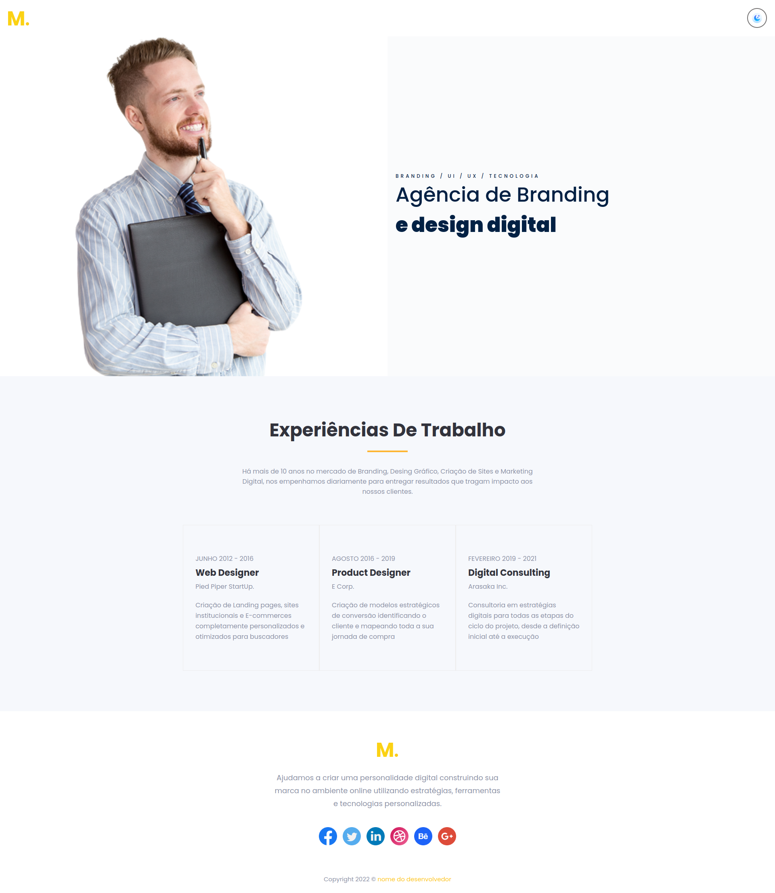
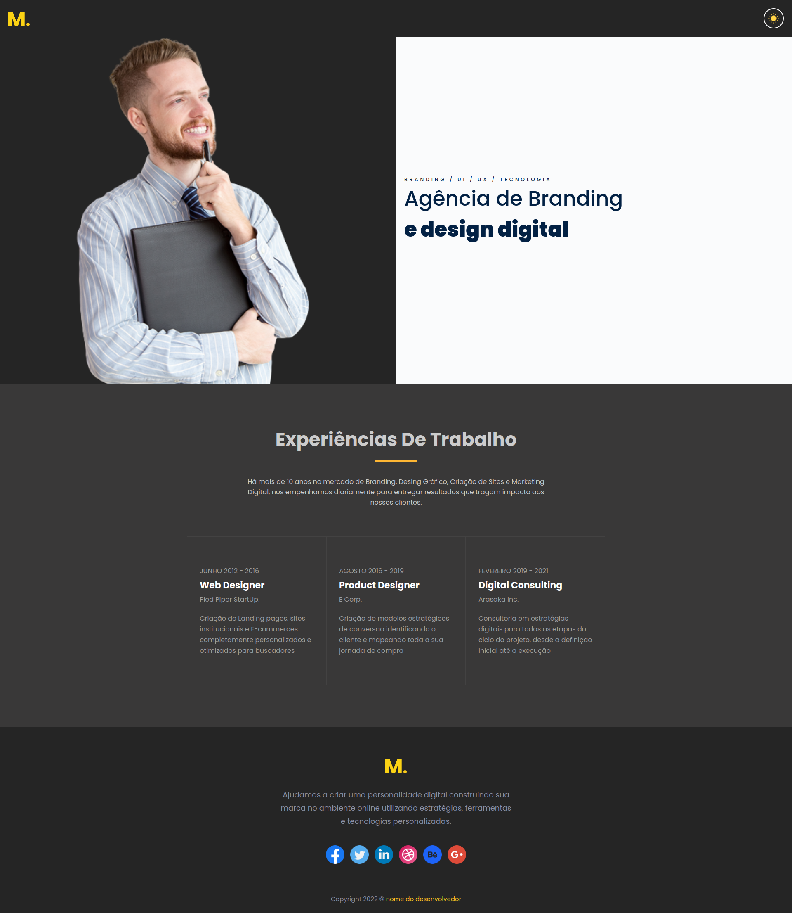

<h1 align="center"> Página de uma agência de design digital </h1>

  <a href="#-tecnologias">Tecnologias</a>&nbsp;&nbsp;&nbsp;|&nbsp;&nbsp;&nbsp;
  <a href="#-projeto">Projeto</a>&nbsp;&nbsp;&nbsp;|&nbsp;&nbsp;&nbsp;
  <a href="#-layout">Layout</a>&nbsp;&nbsp;&nbsp;|&nbsp;&nbsp;&nbsp;
  <a href="#memo-licença">Licença</a>

  

 

  

  

## 🚀 Tecnologias

Esse projeto foi desenvolvido com as seguintes tecnologias:

- Next.Js

## 💻 Projeto

A proposta desse projeto é criar uma página que contenha múltiplos componentes. Ela terá um botão com a capacidade de alterar o tema de todos os seus componentes. Isso será feito utilizando o React JS.

Dessa forma você poderá colocar em prática os seguintes conceitos:

- Utilizar o props para enviar dados de um componente pai para um componente filho;
- Utilizar o props para enviar um state para um componente filho;
- Manipular um state dentro de um componente filho;
- Criar uma funcionalidade que permite alterar o tema de todos os componentes da página através da ação do usuário.

## 🔖 Layout

## :memo: Licença

Esse projeto está sob a licença MIT.

---